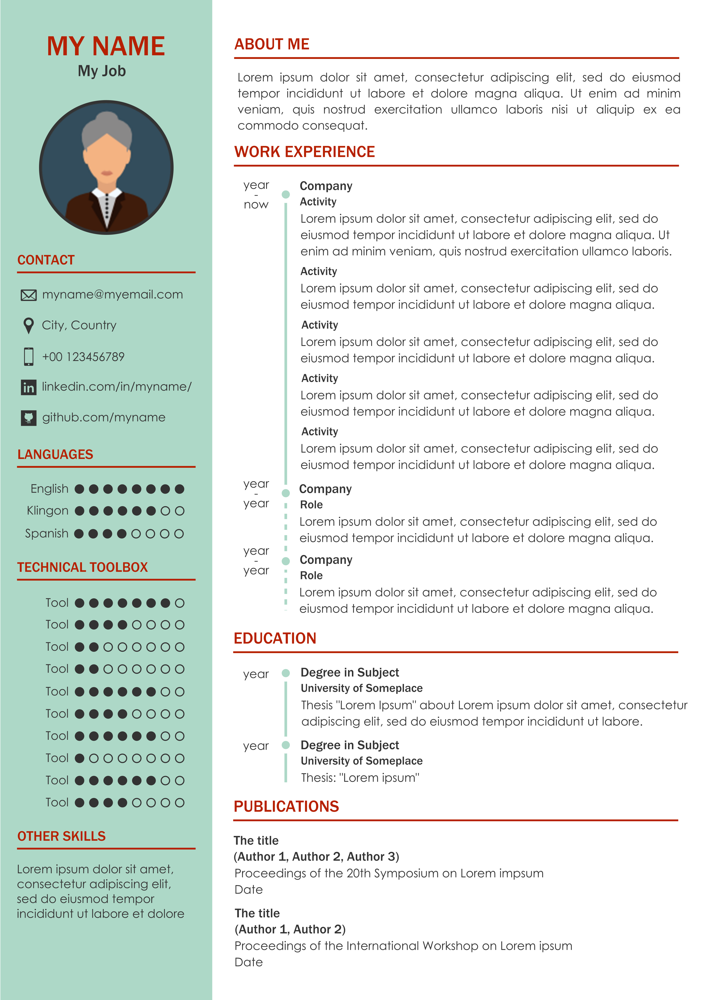

# onepage_svg_resume
A template of a one-page resume, in SVG.

## How does it look like?
There you have it 

You can also have a look at the [PDF version](./CV_template.pdf).

## Why SVG?
Putting everything in a single page is not an easy task. With a vector graphics editor, like [Inkscape](https://inkscape.org/), you have way more control on the elements positioning and formatting than using a documents editor.

Besides that, SVG files are nothing more than XML files that you can manipulate directly. For example you can replace a color of the palette with a simple find-and-replace in a text editor.

SVG files also get along pretty well with web technologies, they can be easily embedded in web pages, or exported to printer-friendly formats or displayed as images.

